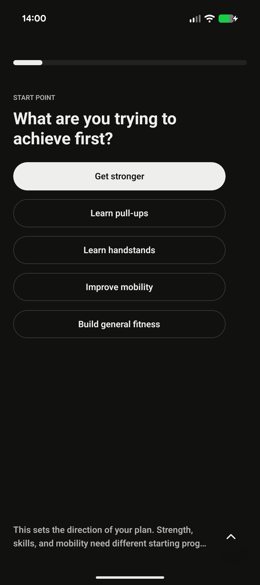
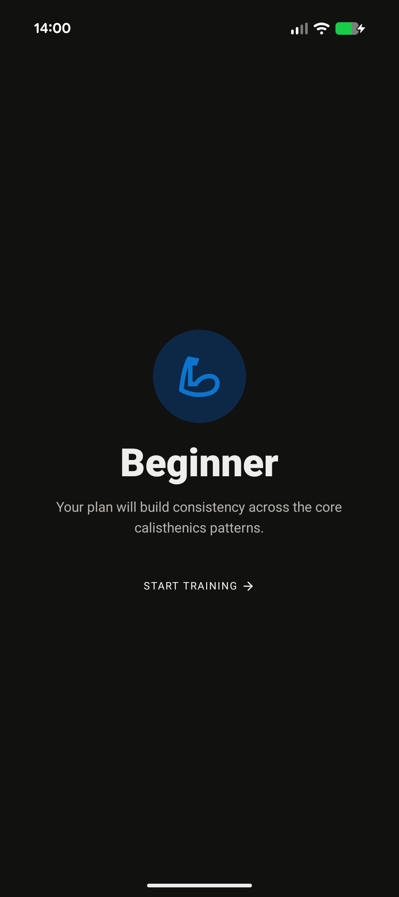
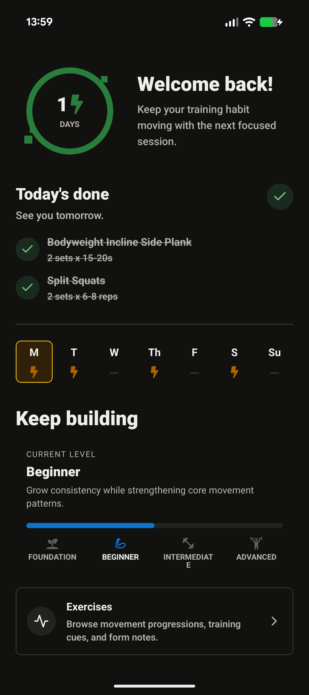
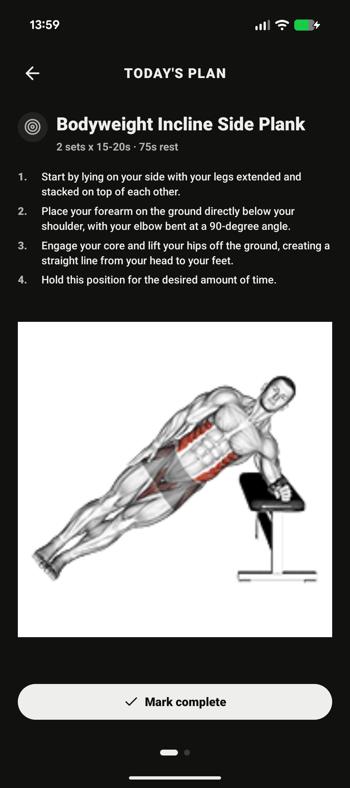
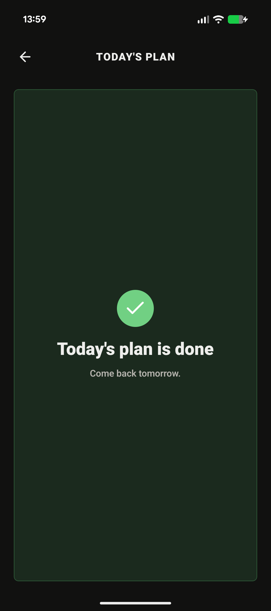
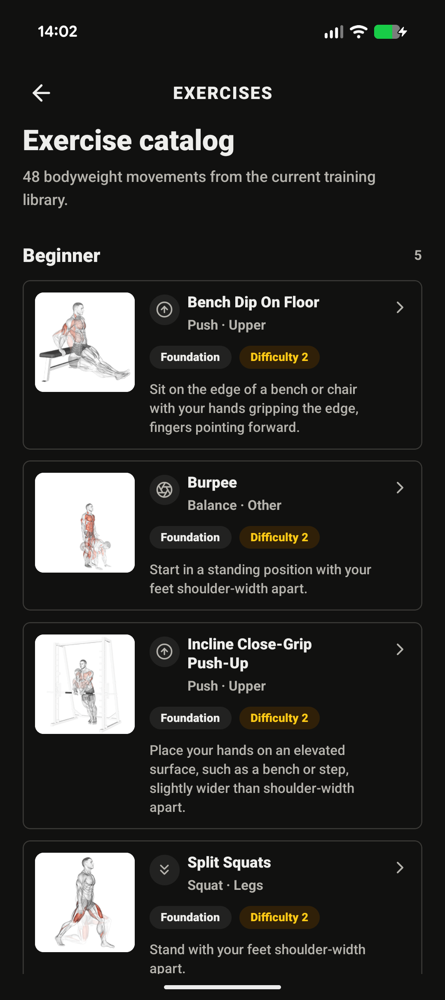

# Calis

Calis is a focused calisthenics training app for building a steady bodyweight
practice. It turns a short ability check into a level-aware plan, gives the user
one clear training session at a time, and keeps progress visible without adding
noise.

The product is intentionally simple: answer a few practical questions, start at
the right level, complete today's movements, and come back tomorrow.

## App Preview

<p>
  
  
  
</p>

<p>
  
  
  
</p>

## What It Does

- Builds a starting profile from onboarding answers about goals, ability,
  equipment, constraints, and training frequency.
- Places the user into one of four training levels: Foundation, Beginner,
  Intermediate, or Advanced.
- Generates a compact daily plan with sets, reps or holds, rest times, and
  step-by-step exercise cues.
- Tracks completion and streaks so consistency is visible from the dashboard.
- Provides an exercise catalog for browsing bodyweight movements, difficulty,
  level placement, movement pattern, and form notes.

## Tech Stack

- Mobile app: Expo, React Native, Expo Router, NativeWind, React Query
- API: FastAPI, SQLModel, SQLite, Alembic
- Package/runtime: Bun
- API contract: OpenAPI schema exported from the backend and generated into
  TypeScript types for the mobile client

## Getting Started

Install dependencies:

```bash
bun install
```

Start the API:

```bash
bun run dev:api
```

Start the mobile app:

```bash
bun run dev:mobile
```

The API script creates a local virtual environment, installs the backend package,
seeds the SQLite database, and starts Uvicorn on port `3001`.

## Useful Commands

```bash
bun run format
bun run format:check
bun run generate:api-types
```

## Documentation

Product and implementation notes live in [docs](./docs/README.md).
